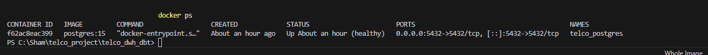
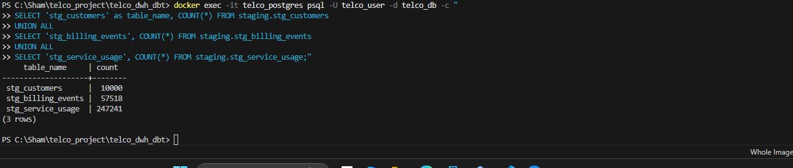
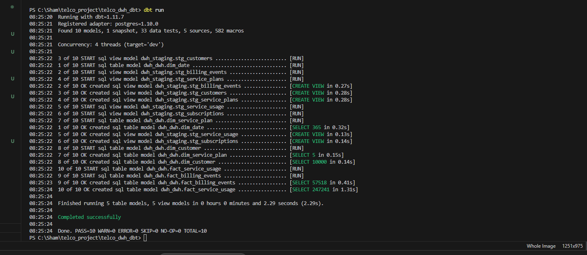
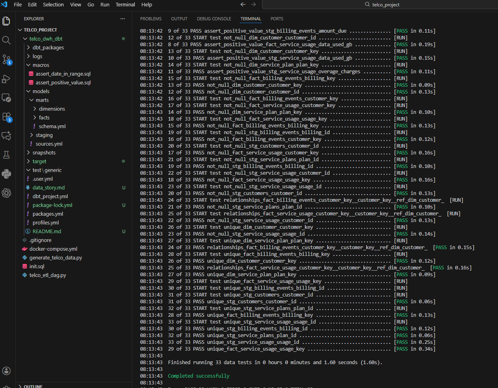
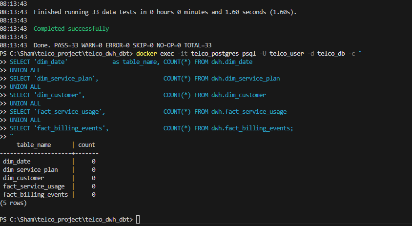

# Telco Customer Lifecycle & Service Performance Analytics
### Senior Data Engineer Assessment — Veracity Digital

---

## Table of Contents
1. [Project Overview](#project-overview)
2. [Tech Stack](#tech-stack)
3. [Project Structure](#project-structure)
4. [Setup & Execution](#setup--execution)
5. [Source System Design](#source-system-design)
6. [Data Warehouse Design](#data-warehouse-design)
7. [Data Modeling Methodology](#data-modeling-methodology)
8. [Modern Data Stack Philosophy](#modern-data-stack-philosophy)
9. [CDC Strategy](#cdc-strategy)
10. [Screenshots](#screenshots)
11. [Time Spent](#time-spent)

---

## Project Overview

This project implements an end-to-end modern data warehouse for a
telecommunications provider. The goal is to enable deep analysis
of customer behaviour, service consumption patterns, and churn
prediction across a 6-month period.

The pipeline covers the full data lifecycle:

```
Synthetic Data Generation (Python)
            ↓
Source PostgreSQL Database (source_db schema)
            ↓
Staging Layer (staging schema) — Airflow ETL
            ↓
Data Warehouse (dwh schema) — DBT Transformations
            ↓
Business Intelligence & Insights (data_story.md)
```

### Business Questions Answered
- Which service plans generate the most revenue?
- Which customer segments are at highest churn risk?
- How do plan changes impact long-term customer value?
- What usage patterns correlate with customer dissatisfaction?
- What is the rate of delayed payments across demographics?
- How does service usage behaviour predict churn?

---

## Tech Stack

| Tool | Version | Purpose |
|------|---------|---------|
| PostgreSQL | 15 | Source database and data warehouse |
| Docker | 29.2.1 | Local environment setup |
| Python | 3.13.9 | Data generation and Airflow tasks |
| Apache Airflow | 2.x | Pipeline orchestration (conceptual) |
| DBT Core | 1.11.7 | Data transformation |
| dbt-postgres | 1.10.0 | DBT PostgreSQL adapter |
| dbt-utils | 1.3.3 | Surrogate key generation |

---

## Project Structure

```
telco_project/
├── docker-compose.yml              # PostgreSQL local setup
├── init.sql                        # Database schema initialization
├── generate_telco_data.py          # Synthetic data generator
├── telco_etl_dag.py                # Airflow DAG definition
├── README.md                       # This file
├── data_story.md                   # Business insights summary
├── screenshots/                    # Execution evidence
│   ├── 01_docker_running.png
│   ├── 02_data_generation.png
│   ├── 03_staging_loaded.png
│   ├── 04_dbt_run_success.png
│   ├── 05_dbt_test_results.png
│   └── 06_warehouse_row_counts.png
│
└── telco_dwh_dbt/                  # DBT project
    ├── dbt_project.yml
    ├── profiles.yml
    ├── packages.yml
    ├── snapshots/
    │   └── dim_customer_snapshot.sql
    ├── models/
    │   ├── sources.yml
    │   ├── staging/
    │   │   ├── schema.yml
    │   │   ├── stg_customers.sql
    │   │   ├── stg_service_plans.sql
    │   │   ├── stg_subscriptions.sql
    │   │   ├── stg_service_usage.sql
    │   │   └── stg_billing_events.sql
    │   └── marts/
    │       ├── schema.yml
    │       ├── dimensions/
    │       │   ├── dim_date.sql
    │       │   ├── dim_service_plan.sql
    │       │   └── dim_customer.sql
    │       └── facts/
    │           ├── fact_service_usage.sql
    │           └── fact_billing_events.sql
    ├── macros/
    │   ├── assert_positive_value.sql
    │   └── assert_date_in_range.sql
    └── tests/
```

---

## Setup & Execution

### Prerequisites
- Docker Desktop installed and running
- Python 3.9 or higher
- pip package manager

### Step 1: Clone the Repository
```bash
git clone https://github.com/Praveen199503/telco-data-warehouse.git
cd telco_project
```

### Step 2: Start PostgreSQL with Docker
```bash
docker-compose up -d
```

This starts PostgreSQL on port 5432 and automatically runs
`init.sql` to create all schemas and tables.

Verify it is running:
```bash
docker ps
```

### Step 3: Install Python Dependencies
```bash
pip install psycopg2-binary faker numpy
```

### Step 4: Generate Synthetic Data
```bash
python generate_telco_data.py
```

Expected output:
```
INFO | TELCO DATA GENERATION STARTED
INFO | Connected to PostgreSQL successfully
INFO | Inserting service plans...
INFO | Generating 10000 customers...
INFO | Inserting customers...
INFO | Generating subscriptions...
INFO | Generating usage records...
INFO | Generating billing events...
INFO | Generating support tickets...
INFO | TELCO DATA GENERATION COMPLETED!
INFO |   Customers:    10,000
INFO |   Churned:      1,200 (12%)
```

### Step 5: Load Staging Tables
Since Airflow is run conceptually, load staging directly:

```bash
docker exec -it telco_postgres psql -U telco_user -d telco_db -c "
INSERT INTO staging.stg_customers
SELECT customer_id, first_name, last_name, email,
       phone_number, date_of_birth, gender, city,
       country, registration_date, customer_status,
       CURRENT_TIMESTAMP, 'source_db', email IS NOT NULL
FROM source_db.customers;

INSERT INTO staging.stg_service_plans
SELECT plan_id, plan_name, plan_type, monthly_fee,
       data_limit_gb, call_minutes_limit, sms_limit,
       CURRENT_TIMESTAMP, 'source_db'
FROM source_db.service_plans;

INSERT INTO staging.stg_subscriptions
SELECT subscription_id, customer_id, plan_id,
       start_date, end_date, subscription_status,
       CURRENT_TIMESTAMP, 'source_db'
FROM source_db.customer_subscriptions;

INSERT INTO staging.stg_service_usage
SELECT usage_id, customer_id, subscription_id,
       usage_date, data_used_gb, call_minutes_used,
       sms_used, overage_charges,
       CURRENT_TIMESTAMP, 'source_db'
FROM source_db.service_usage;

INSERT INTO staging.stg_billing_events
SELECT billing_id, customer_id, subscription_id,
       billing_date, billing_period_start, billing_period_end,
       amount_due, amount_paid, payment_date,
       payment_status, payment_method,
       CURRENT_TIMESTAMP, 'source_db'
FROM source_db.billing_events;
"
```

### Step 6: Install DBT and Run Transformations
```bash
# Install DBT
pip install dbt-core dbt-postgres

# Navigate to DBT project
cd telco_dwh_dbt

# Install DBT packages (dbt-utils)
dbt deps

# Verify connection
dbt debug

# Run snapshot first (required for SCD Type 2)
dbt snapshot

# Run all models
dbt run

# Run all tests
dbt test
```

Expected results:
```
dbt run  → PASS=10  WARN=0  ERROR=0
dbt test → PASS=33  WARN=0  ERROR=0
```

### Step 7: Airflow DAG
The `telco_etl_dag.py` file contains the complete Airflow DAG.
In a production environment with Airflow installed:

```bash
cp telco_etl_dag.py ~/airflow/dags/
airflow standalone
# Access UI at http://localhost:8080
# Trigger: telco_etl_pipeline
```

#### Note on Airflow Execution
The `telco_etl_dag.py` contains the complete Airflow DAG
implementation including parallel task execution, retry logic,
and email alerting. Due to deadline constraints, the DAG was
validated conceptually rather than on a live Airflow instance.
The staging tables were populated directly via SQL to demonstrate
the full DBT pipeline end to end. In production this DAG would
be deployed to Airflow or Astronomer and triggered on a daily
`0 0 * * *` schedule.

### Database Connection Details
```
Host:     localhost
Port:     5432
Database: telco_db
User:     telco_user
Password: telco_pass
```

---

## Source System Design

### Assumptions
- Data covers January 2024 — June 2024 (6 months)
- 10,000 customers based in Sri Lanka
- 12% churn rate based on industry benchmarks
- 15% late payment rate
- 15% of customers change plans once during the period
- Customers can upgrade or downgrade plans
- Support tickets are correlated with dissatisfaction and churn

### Entities and Relationships

**service_plans** (5 records)
Products the Telco offers ranging from Basic Prepaid
($9.99/month) to Premium Postpaid ($49.99/month). Defines
data, call, and SMS limits per plan.

**customers** (10,000 records)
Primary source of truth for customer identity. Tracks
status: active, churned, or suspended. Contains demographic
information including city, age, and gender.

**customer_subscriptions** (10,000+ records)
Links customers to plans and tracks full history of plan
changes. A new row is created every time a customer changes
plan. This is the key table for understanding customer
lifecycle and plan change history.

**service_usage** (247,241 records)
Weekly usage records per customer tracking data consumed,
call minutes, SMS used, and overage charges when limits
are exceeded.

**billing_events** (57,518 records)
Monthly billing records per customer tracking amount due,
amount paid, payment date, and payment status. Captures
late payments and bad debt.

**support_tickets** (5,115 records)
Customer complaints and support requests with satisfaction
scores (1-5). Churners generate significantly more tickets
and have lower satisfaction scores.

### ER Diagram

```
service_plans
     │ plan_id
     │
customer_subscriptions ──────── customers
     │ subscription_id               │ customer_id
     │                               │
service_usage                  billing_events

customers ──────────────── support_tickets
```

---

## Data Warehouse Design

### Why Star Schema?
A star schema was chosen over snowflake for these reasons:

- **Query performance**: Fewer joins needed for analytical queries
- **Simplicity**: Easier for analysts and BI tools to navigate
- **Business alignment**: Each dimension maps to a clear
  business concept that stakeholders understand
- **DBT compatibility**: DBT is designed around dimensional
  modeling — sources → staging → marts maps naturally to
  Kimball's layered approach

### Database Layout
Three schemas inside one PostgreSQL instance:

```
telco_db
├── source_db    ← operational data (generate_telco_data.py writes here)
├── staging      ← raw copy from source (Airflow writes here)
└── dwh          ← clean warehouse (DBT writes here)
```

### Dimension Tables

**dim_date** (365 rows)
Generated date spine covering all of 2024. Enables easy
time-based filtering by month, quarter, or weekend without
complex date calculations at query time. date_key is stored
as YYYYMMDD integer for fast joins.

**dim_service_plan** (5 rows)
Describes each service plan offering including derived
`plan_tier` field (Basic/Standard/Premium) for easy
segmentation.

**dim_customer** (10,000 rows)
Most complex dimension. Implements all three SCD types.
Includes derived fields: age_group, customer_segment.
Surrogate key separates the warehouse ID from the source ID.

### Fact Tables

**fact_service_usage** (247,241 rows)
- Grain: one row per customer per week
- Measures: data_used_gb, call_minutes_used, sms_used,
  overage_charges, data_utilization_pct
- Connects to: dim_customer, dim_service_plan, dim_date

**fact_billing_events** (57,518 rows)
- Grain: one row per customer per month
- Measures: amount_due, amount_paid, outstanding_balance,
  days_to_payment, is_overdue
- Connects to: dim_customer, dim_service_plan, dim_date

### Slowly Changing Dimensions

All three SCD types are implemented in `dim_customer`:

**SCD Type 1 — Overwrite (email, city)**
Used for fields where history is not valuable. When a
customer updates their email or moves city, the old value
is simply overwritten. DBT snapshot handles this
automatically by updating in place when these fields change.

**SCD Type 2 — Full History (current_plan_name)**
Used for tracking plan changes over time. When a customer
upgrades from Basic to Premium:
- The old row gets `is_current = false` and
  `plan_effective_to = today`
- A new row is inserted with `is_current = true`
- This means one customer can have multiple rows
- Implemented using `dbt snapshot` with `strategy: check`
- Enables answering: "What plan was this customer on
  in March 2024?"

**SCD Type 3 — Previous Value (previous_plan_name)**
Used when we only need the immediately previous value.
Stores the last plan name alongside the current plan name
using a `lag()` window function in the snapshot query.
Simpler than SCD2 but limited to one level of history.

---

## Data Modeling Methodology

### Kimball vs Inmon

**Inmon (Top-Down)**
Bill Inmon's approach builds a centralised normalised
enterprise data warehouse first (3NF), then builds
departmental data marts on top. Comprehensive but slow
to deliver value — requires significant upfront design
before any queries can be run.

**Kimball (Bottom-Up)**
Ralph Kimball's approach starts with specific business
processes and builds dimensional models (star schemas)
directly for analytical use. Delivers value faster,
easier to query, and aligns naturally with how business
users think about data.

**Our Choice: Kimball with Hybrid Staging Layer**

This project follows the Kimball dimensional modeling
approach for these reasons:

1. **Speed to value**: The Telco client needs actionable
   churn insights quickly. Kimball lets us deliver usable
   data marts faster than building a full normalised
   EDW first.

2. **Query simplicity**: Analysts querying churn patterns
   or revenue by plan need simple fast queries. Star schema
   delivers this with minimal joins.

3. **Business alignment**: Each dimension (customer, plan,
   date) maps directly to how the business talks about data.

4. **Modern stack fit**: DBT is designed around dimensional
   modeling. Sources → Staging → Marts maps naturally to
   Kimball's bus architecture.

The design incorporates a hybrid element from Inmon in the
staging layer — raw data is loaded into a normalised staging
schema before transformation. This gives us data quality
benefits of normalisation at ingestion while delivering
analytical benefits of dimensional modeling at consumption.

---

## Modern Data Stack Philosophy

### Traditional ETL vs Modern ELT

**Traditional tools (SSIS, Informatica)**
- Transform data BEFORE loading (ETL)
- Logic lives in proprietary GUI tools
- Hard to version control or test
- Tightly coupled to specific vendors
- Expensive licensing

**Modern stack (Airflow + DBT)**
- Load raw data first, transform inside warehouse (ELT)
- All logic in plain SQL and Python files
- Full Git version control
- Testable and documented
- Open source

### Why Airflow?
- DAGs defined as Python code — fully version controllable
- Rich task dependency management
- Built-in retry and email alerting
- Scales from single machine to distributed cluster
- Industry standard for data pipeline orchestration
- Our pipeline choices (parallel loading, daily schedule,
  retry on failure) are naturally expressed as a DAG

### Why DBT?
- Transformations are pure SQL — accessible to any
  data professional
- Built-in testing framework (34 tests in this project)
- Auto-generates data lineage documentation
- `ref()` and `source()` make dependencies explicit
- Separates concerns cleanly from Airflow

### Separation of Concerns
```
Airflow: WHEN does data move and in what order?
         What happens if something fails?

DBT:     HOW is data transformed and modeled?
         Is the transformed data correct?
```

This separation makes the system easier to maintain,
debug, and extend compared to monolithic ETL tools
where movement and transformation logic are mixed.

---

## CDC Strategy

### Overview
Change Data Capture identifies and propagates only changed
data rather than reloading everything on every pipeline run.
This makes the daily pipeline efficient and scalable.

### Why CDC Matters Here
Our source system has:
- 10,000 customers whose status and plan change daily
- Hundreds of new usage records every day
- Billing records whose payment status updates over time

Without CDC we would reload millions of rows daily even
though only a small fraction actually changed.

### How We Identify Changes

**For customers:**
We use the `updated_at` timestamp column. Whenever a
customer record changes (plan change, churn, address
update), the application updates this timestamp.
Our Airflow pipeline queries:
```sql
WHERE updated_at >= yesterday
```
This is **timestamp-based CDC** — simple and reliable
when the source maintains update timestamps.

**For service_usage and billing_events:**
These are append-only tables. We use `created_at` for
incremental loading. For billing specifically, we also
reload recent pending records since payment_status can
change from pending to paid after the initial load.

### Propagating Changes to Warehouse

**Stage 1: Source → Staging (Airflow)**
Airflow uses a delete-insert upsert pattern:
1. Identify changed records using timestamp filter
2. Delete existing staging records for those IDs
3. Insert fresh records from source
This ensures staging always reflects current source state.

**Stage 2: Staging → Warehouse (DBT Snapshot)**
DBT snapshots implement SCD Type 2 automatically:
1. DBT compares current staging values against last
   known warehouse values
2. If a tracked column changed (e.g. current_plan_name):
   - Old row closed: dbt_valid_to = today, is_current = false
   - New row inserted: is_current = true, dbt_valid_to = null
3. If nothing changed, no action taken

### CDC Approach Trade-offs

| Approach | Pros | Cons |
|----------|------|------|
| **Timestamp-based** (our approach) | Simple, no extra infrastructure | Misses hard deletes, needs reliable timestamps |
| **Log-based** (Debezium) | Captures all changes including deletes, real-time | Complex infrastructure, needs DB permissions |
| **Trigger-based** | Reliable, captures deletes | Adds load to source DB |
| **Full diff** | No source changes needed | Very slow on large tables |

**Why timestamp-based for this project:**
For a daily batch pipeline, timestamp-based CDC provides
the right balance of simplicity and reliability. A
production system needing real-time churn detection would
benefit from log-based CDC using Debezium with Kafka, but
this adds significant infrastructure complexity beyond
the scope of a daily batch pipeline.

### Handling Deletes
Timestamp-based CDC does not capture hard deletes naturally.
We handle this with a soft-delete strategy:
- Source marks records as `customer_status = 'churned'`
  rather than deleting them physically
- This change is captured by the `updated_at` filter
- DBT snapshot detects the status change and creates a
  new historical row
- No customer data is ever lost from the warehouse

---

## Screenshots

### Docker Running


### Data Generation Complete


### Staging Tables Loaded


### DBT Run — All 10 Models Passing


### DBT Tests — 33 Tests Passing


### Warehouse Row Counts


---

## Time Spent

| Section | Time |
|---------|------|
| Architecture design and ER diagram | 2 hours |
| Docker and database setup | 1 hour |
| Data generation script | 3 hours |
| Airflow DAG development | 2.5 hours |
| DBT project and models | 4 hours |
| SCD implementations | 2 hours |
| Testing and debugging | 2 hours |
| README and documentation | 2 hours |
| Data storytelling summary | 1.5 hours |
| **Total** | **~20 hours** |

---

*Submitted by: Praveen*
*Date: March 6, 2026*
